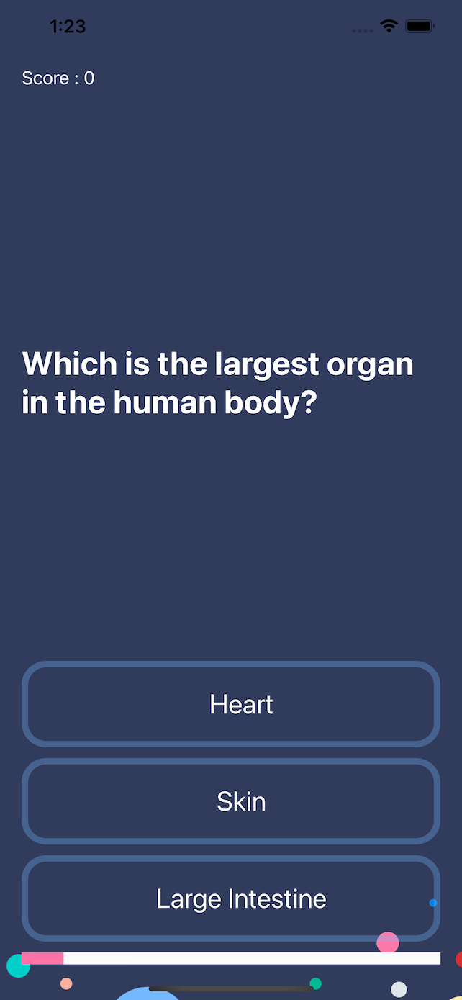
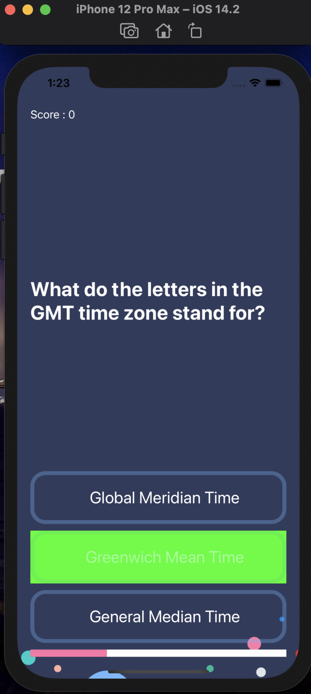
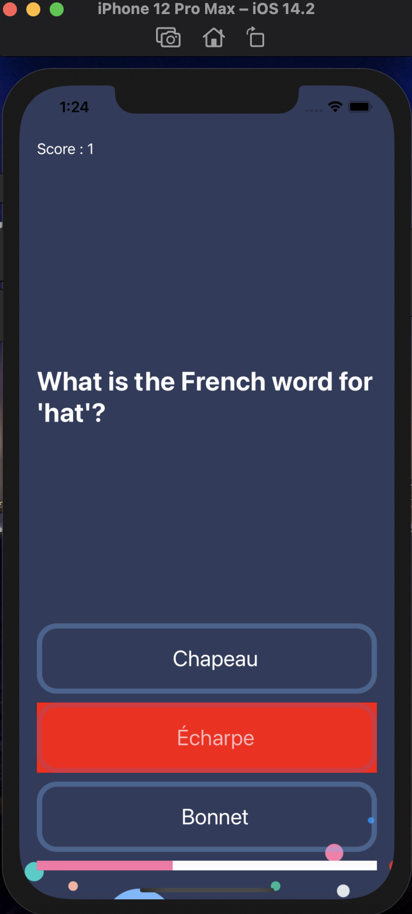
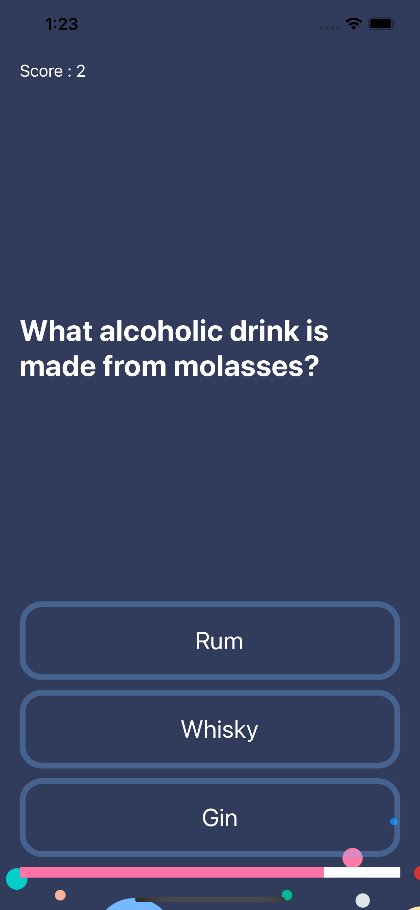

    

#  Quizzler

## What is it ?

* It is a trivia quiz app which has multiple choice type questions implemented using Swift5 and XCode. 
* Use of UI elements such as Labels and Buttons and changing them programmatically. 
* Use of MVC (Model-View-Controller) design pattern. 
* Implementation of Swift Struct and Classes.

## App Screenshots

 |  (First Question) |  (Correct Answer) |  (Wrong Answer)|
 |:---:|:---:|:---:|
 
  (Random Question - 1) | (Random Question - 2) |
 |:---:|:---:|
 
