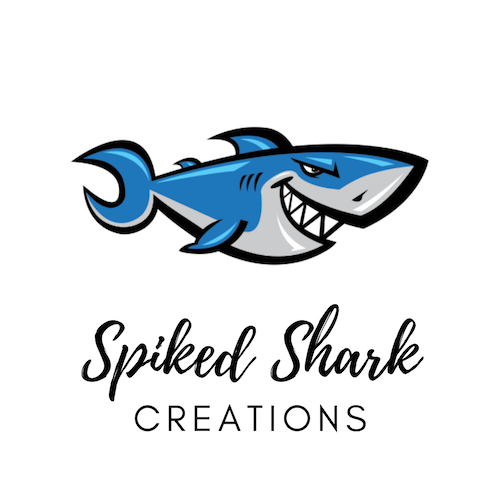

{:height="50%" width="50%"}

#  Quizzler

## What is it ?

* It is a trivia quiz app which has multiple choice type questions implemented using Swift5 and XCode. 
* Use of UI elements such as Labels and Buttons and changing them programmatically. 
* Use of MVC (Model-View-Controller) design pattern. 
* Implementation of Swift Struct and Classes.

## App Screenshots

### First Question

{:height="50%" width="50%"}

### Correct Answer

{:height="50%" width="50%"}

### Wrong Answer

{:height="50%" width="50%"}

### Random Question

{:height="50%" width="50%"}

